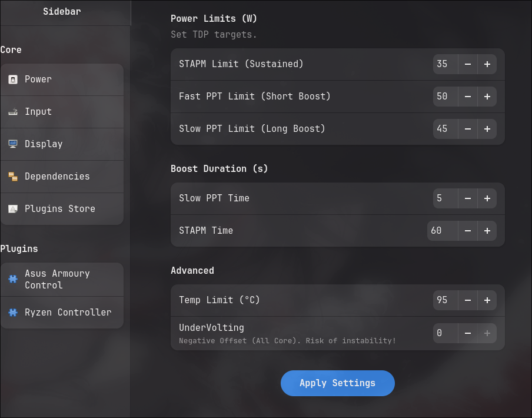

# Ryzen Controller Plugin

**Ryzen Controller** is a lightweight Kerneldrive plugin that provides advanced power and thermal management for AMD Ryzen mobile processors.

---

## Features

- **Power Limits (TDP)**: Fine-tune STAPM, Fast PPT, and Slow PPT limits
- **Boost Control**: Adjust boost duration windows
- **Temperature Limits**: Set maximum TCTL temperature
- **Curve Optimizer**: Apply all-core negative offsets (Undervolting)
- **Configuration Rice**: Robust persistence via `tuning.ini`

---

## Usage

1. Download [KernelDrive](https://github.com/acedmicabhishek/KernelDrive)
2. Open KernelDrive → Plugin Store → Search **Ryzen Controller** → Install
3. Reboot and tune your performance
